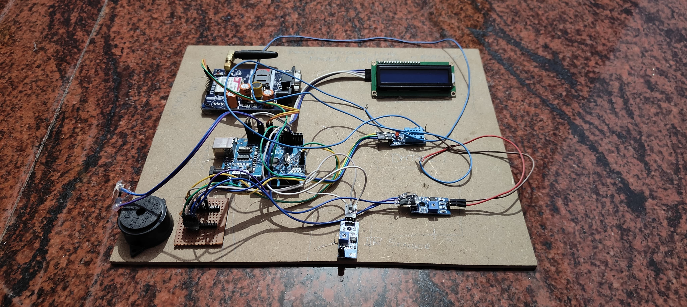

# EPICS (Engineering Projects for Community Services)

## Transmission Line fault Detection

This is an IoT(Internet of things) based project
Now a days transmission line protection is a key problem in power transmission lines because (85-87) percentage of power system disturbances are occurring in 
transmission lines. Identification of fault source is tedious task; fast fault detection
can help to protect the equipment before any significant damage of the equipment. 
The exact fault location can help service man to remove persistent of the faults and 
locate the areas where the faults occur regularly, thus reducing the occurrence of 
fault and minimize the time of power outages. The paper is intended to detect the 
location of fault in transmission line using an Arduino board and the same is 
transmitted to control Centre using Arduino nano device. In this proposed thesis, 
we sense the current by placing the conducting wire inside the loop of the current 
transformer and is given to the protective circuit to avoid the high current. This is 
given to the Arduino Nano(microcontroller). The fire sensor (An IR Receiver) is 
given to the Arduino to detect the presence of any fire. In case there is a short 
circuit, the current in the series resistors modifies accordingly to the resistance that 
modifies with the distance and the load which is connected through a relay to the 
Arduino is turned OFF when the resistance is below threshold value. In addition, 
this thesis can also be empowered by using capacitor in the AC circuit to measures 
the impedance that could also locate the open circuit cable. An LCD display will 
indicate the status of the transmission lines and buzzer will sound when fault is 
detected. The SMS alerts will be going to be sent to the corresponding number 
through GSM Modem. 

**Keywords :**  Arduino Nano, Microcontroller, LCD, SMS.

### WORKING  
The set up or field device consists of 2 major components, GSM and microcontroller. 
The over voltage sensor, fire sensor, short circuit and open circuit sensors are attached 
to both microcontroller and transmissions lines maintaining the connection between 
them, meanwhile the Arduino is connected to RPS and the LCD, buzzer, GSM are 
connected to Arduino completing the circuit. When supply is given to the circuit, if there 
is any fault in the circuit like high voltage or over voltage the voltage sensor comes in to 
work and indicates the Arduino which sends signal to lcd to display  that there is a short 
circuit at a specific area and also the buzzer will be alerted, and GSM sends SMS to 
mobile .Same process will be continued for all the sensors, if there is a fire at any of the 
transmission lines the fire sensor comes in to work, if there is any open and short 
circuit respective sensors come in to work. In this process we can detect four types of 
faults They are: over voltage fault, fire fault, short circuit fault and open circuit 
fault. 
- **Over Voltage Fault**: It occurs whenever high current follows through 
transmission line and This system detects that and send SMS by GMS 
modem and displays the fault. 
- **Fire Fault:** If fire accidents take place in transmission line and This system 
detects that by fire sensor and send SMS by GMS modem and displays the 
fault. 
- **Short Circuit Fault:**  When two lines touches each other in transmission 
line and This system detects that and send SMS by GMS modem and 
displays the fault. 
- **Open Circuit Fault:** Whenever line is broken in transmission line and This 
system detects that and send SMS by GMS modem and displays the fault .
### Prototype Image

